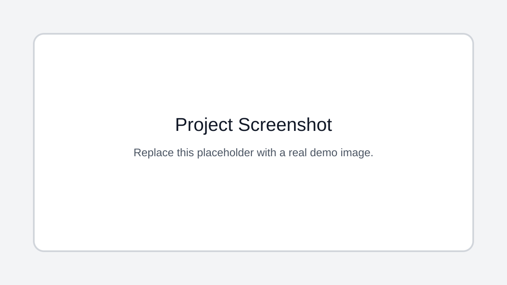

# Video Action Recognition with CNN, LSTM, and Transformer Models

## Description

A video action recognition experiment that extracts CNN features from video frames and trains sequence models for action classification.

## Key Features

- Video frame sampling with OpenCV
- VGG16 feature extraction
- LSTM sequence classifier
- Transformer encoder experimentation
- Saved Keras model artifacts

## Tech Stack

- Python
- Jupyter Notebook
- TensorFlow
- Keras
- VGG16
- LSTM
- OpenCV

## Installation

pip install tensorflow opencv-python scikit-learn numpy

## Usage

Open the notebook in Kaggle or Colab, make the action-recognition dataset available, and run feature extraction/training cells.

## Screenshots

Add project screenshots to the `screenshots/` folder. Replace `demo.svg` with the actual image filename when screenshots are available.

## License

No license file is currently included. Add a license before reusing, distributing, or publishing this project for public collaboration.

